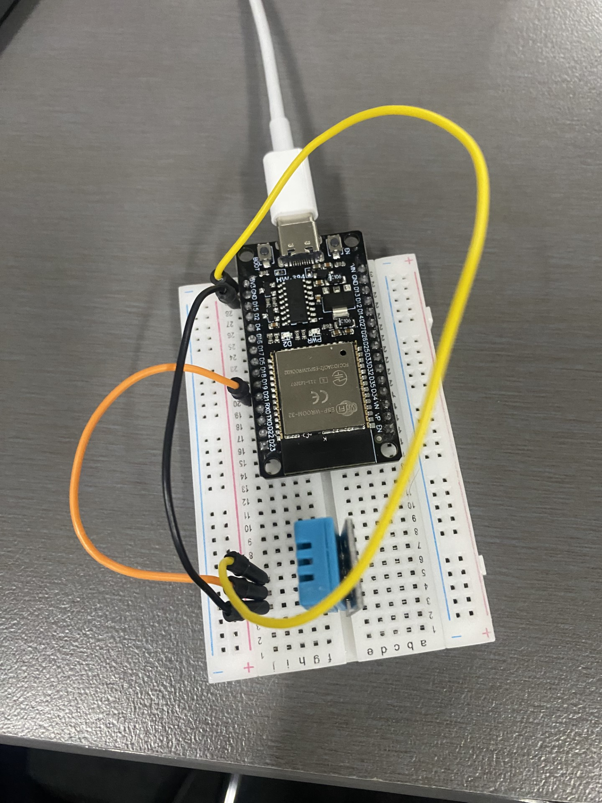

1. Project Overview
The project consists of two main components:

Node.js Server: This component serves as the backend for the project, responsible for receiving, storing, and serving data from the ESP32 weather station.

ESP32 Weather Station: The ESP32 microcontroller captures temperature and humidity data using a DHT sensor and sends this information to the Node.js server using HTTP requests.

2. Requirements:
Node.js (v14 or higher)
NPM (Node Package Manager)
Arduino IDE for ESP32 development
ESP32 development board (breadboard)
DHT22 or DHT11 sensor for temperature and humidity measurements
USB cable for connecting the ESP32 to your computer
3. Getting Started
Follow these steps to get started with the project:

1.Clone the project repository to your local machine.

2.Install the required Node.js packages by running npm install in the project's root directory.

3.Set up your ESP32 microcontroller with the DHT sensor and the necessary code to send data to the Node.js server.

4.Configure the ESP32 to connect to your local Wi-Fi network.

5.Start the Node.js server by running npm start in the project directory.

6.Access the web interface or API to view real-time temperature and humidity data.

4. Project Structure
/nodejs-server: Contains the Node.js server code and configurations.
/esp32-code: Includes the Arduino code for the ESP32 weather station.
/web-interface: Contains a basic web interface for viewing the data.
5. Node.js Server
The Node.js server is the core of this project. It is responsible for handling incoming data from the ESP32 weather station and serving it via a web interface or API. It uses the Express.js framework to set up HTTP routes and the required logic for data processing.

6. ESP32 Weather Station
The ESP32 Weather Station is responsible for measuring temperature and humidity using the DHT sensor. It sends this data to the Node.js server using HTTP POST requests. Make sure to configure the ESP32 with the correct Wi-Fi credentials and the server's IP address.

7. Usage
Start the Node.js server: npm start
Upload the ESP32 code to your microcontroller.
Access the web interface at http://localhost:3000 to view temperature and humidity data.

 

 